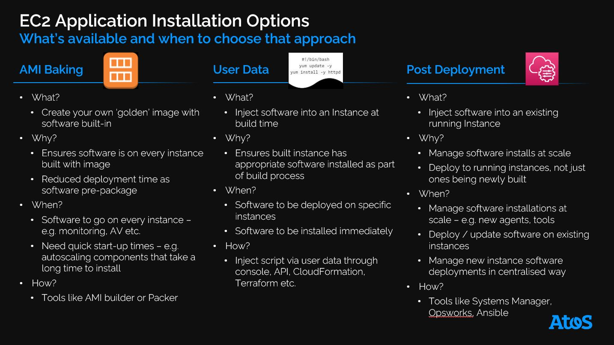
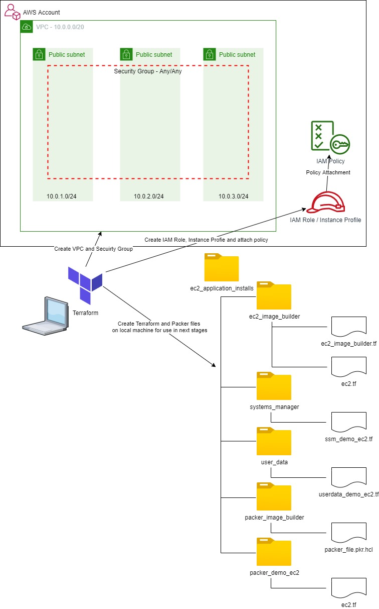
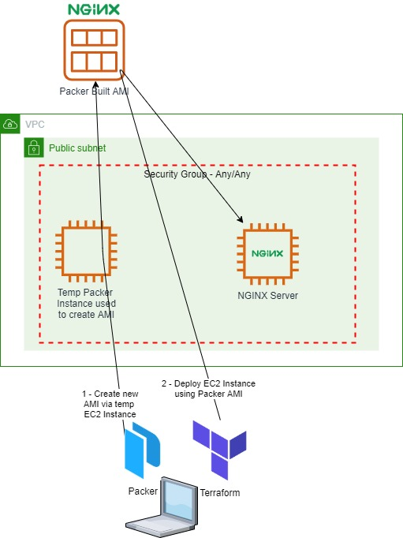
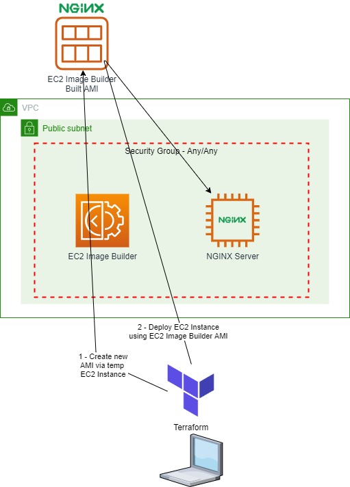
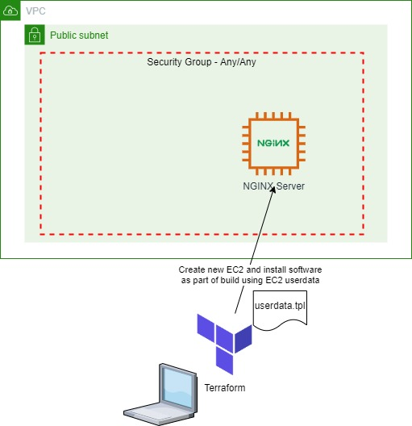
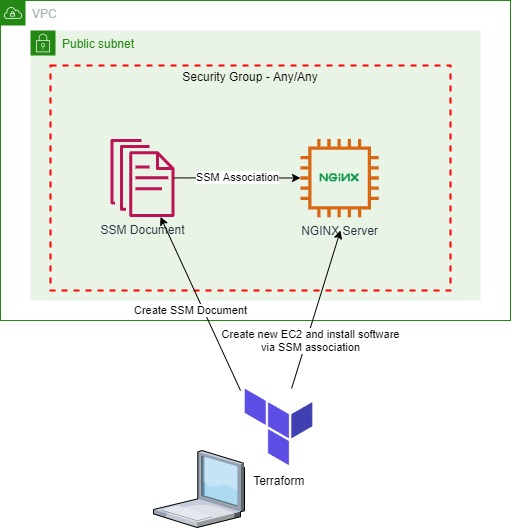

# ec2-application-installs
## Options for deploying applications onto EC2 instances

### Authenticate to AWS on the command line: -
 - e.g. type the following commands, substituting the correct values
 - export AWS_ACCESS_KEY_ID=<Enter your access key>
 - export AWS_SECRET_ACCESS_KEY=<Enter your secret access key>
 - export AWS_DEFAULT_REGION=<Enter your region>

### Build the pre-requisite network, IAM role and instance profile and additional Terraform and Packer files used by the next stage: -

 - cd base_environment
 - terraform init
 - terraform apply -var-file="../variables.tfvars" -auto-approve

## AMI Baking
### AMI Baking with Packer and then Test building an EC2 Instance from the new Packer AMI: -

  - cd ../packer_image_builder
  - packer init .
  - packer build .
  - Once the Packer AMI is available build an EC2 image with that AMI
  - cd ../packer_demo_ec2
  - terraform init
  - terraform apply -var-file="../variables.tfvars" -auto-approve
  - Use the public IP (from console or conveniently provided as a Terraform output) of the built instance and check you can connect via http (should get a customer NGINX page that mentions Packer)
  - Once you've finished with the demo delete the new EC2 to save cost
  - terraform destroy -var-file="../variables.tfvars" -auto-approve
  - Go into the AWS console and delete the Packer created AMI and associated snapshot

### AMI Baking with EC2 Image Builder and then Test building an EC2 Instance from the new EC2 Image Builder AMI: -

  - cd ../ec2_image_builder
  - terraform init
  - terraform apply -var-file="../variables.tfvars" -auto-approve
  - At this point you need to wait for the EC2 Image Builder Process to complete, which in my experience can take some time (approx 20 mins for this demo).  You can view progress in the EC2 Image Building Console.  Once complete create an EC2 Image with the new AMI
  - cd ../image_builder_demo_ec2
  - terraform init
  - terraform apply -var-file="../variables.tfvars" -auto-approve
  - Use the public IP (from console or conveniently provided as a Terraform output) of the built instance and check you can connect via http (should get a customer NGINX page that mentions EC2 Image Builder)
  - Once you've finished with the demo delete the new EC2 to save cost
  - terraform destroy -var-file="../variables.tfvars" -auto-approve
  - cd ../ec2_image_builder
  - terraform destroy -var-file="../variables.tfvars" -auto-approve
  - Go into the AWS console and delete the EC2 Image Builder created AMI and associated snapshot

## Userdata
### Create an EC2 Image from a generic AMI and install software as part of EC2 userdata: -
  
  - cd ../user_data
  - terraform init
  - terraform apply -var-file="../variables.tfvars" -auto-approve
  - Use the public IP (from console or conveniently provided as a Terraform output) of the built instance and check you can connect via http (should get a customer NGINX page that mentions Userdata)
  - Once you've finished with the demo delete the new EC2 to save cost
  - terraform destroy -var-file="../variables.tfvars" -auto-approve

## Post Deployment
### Create an EC2 Image from a generic AMI and install software via Systems Manager: -
  
  - cd ../systems_manager
  - terraform init
  - terraform apply -var-file="../variables.tfvars" -auto-approve
  - Use the public IP (from console or conveniently provided as a Terraform output) of the built instance and check you can connect via http (should get a customer NGINX page that mentions Systems Manager)
  - Once you've finished with the demo delete the new EC2 to save cost
  - terraform destroy -var-file="../variables.tfvars" -auto-approve

  Once all usage is compelte destroy the base environment: -
   - cd ../base_environment
   - terraform destroy -var-file="../variables.tfvars" -auto-approve

  Please see my [blog article](https://markrosscloud.medium.com/options-for-installing-applications-on-ec2-and-when-you-might-use-them-940188febda7) for more information.